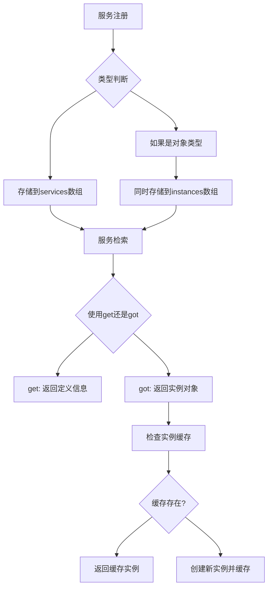

# 项目概述

## 项目简介

FastD Container 是 FastD 框架的核心组件之一，是一个轻量级但功能强大的PHP依赖注入容器。它遵循PSR-11标准，提供了简洁易用的API来管理应用程序中的服务依赖关系。

## 核心特性

### PSR-11 标准兼容
完全实现 [PSR-11 Container Interface](https://www.php-fig.org/psr/psr-11/) 标准，确保与其他符合PSR-11标准的库和框架兼容。

### 多种服务类型支持
容器支持注册和管理各种类型的服

### 自动数组合并
当向已存在的数组类型服务添加数据时，自动进行数组合并而非覆盖。

### 单例模式
通过 `got()` 方法获取的服务实例会被缓存，后续调用返回同一实例。

### 服务提供者
支持通过服务提供者批量注册服务，便于模块化管理。

### 接口实现
实现了 `ArrayAccess` 和 `Iterator` 接口，可以用数组语法操作容器。

## 架构设计

### 核心组件

#### Container 类
主要的容器实现类，负责服务的注册、存储和检索。

**主要职责**：
- 服务注册和存储
- 服务类型识别和处理
- 实例缓存管理
- PSR-11接口实现

#### 服务类型识别
容器能够智能识别不同类型的服务：

| 类型 | 识别条件 | 存储方式 |
|------|----------|----------|
| closure | `instanceof Closure` | 直接存储 |
| object | `is_object()` | 直接存储 + 缓存实例 |
| class | `is_string() && class_exists()` | 存储类名 |
| callable | `is_callable()` | 直接存储 |
| 其他 | `default` | 使用 `gettype()` |

#### 服务生命周期

### 设计原则

#### 单一职责原则
每个方法都有明确的单一职责：
- `add()`: 注册服务
- `get()`: 获取服务定义
- `got()`: 获取服务实例
- `has()`: 检查服务存在性
- `clear()`: 清除服务

#### 开放封闭原则
通过 `ServiceProviderInterface` 提供扩展点，允许第三方扩展服务注册功能。

#### 里氏替换原则
完全兼容PSR-11标准，可以无缝替换其他PSR-11实现。

## 性能考虑

### 内存优化
- 对象类型服务直接缓存实例
- 避免重复创建相同服务的实例
- 及时清理不再需要的服务

### 执行效率
- 使用 `match` 表达式进行高效类型匹配
- 数组操作采用内置函数优化
- 避免不必要的对象创建

## 适用场景

### Web应用开发
- 控制器依赖注入
- 数据库连接管理
- 缓存服务配置
- 日志服务管理

### 微服务架构
- 服务发现和注册
- 配置管理中心
- 依赖关系管理

### 命令行工具
- 命令处理器注册
- 工具类依赖管理
- 配置项集中管理

## 技术栈

- **PHP版本**: >= 8.2
- **依赖标准**: PSR-11 Container Interface ^2.0
- **测试框架**: PHPUnit ^9.0
- **构建工具**: Composer

## 项目历史

FastD Container 最初作为 [FastD框架](https://github.com/JanHuang/fastD) 的核心组件开发，后来独立出来作为一个通用的依赖注入容器库，服务于更广泛的PHP开发生态。

## 贡献与发展

项目采用MIT开源协议，欢迎社区贡献。主要发展方向包括：

- 更多服务类型的支持
- 性能优化和内存管理改进  
- 更丰富的配置选项
- 更完善的文档和示例